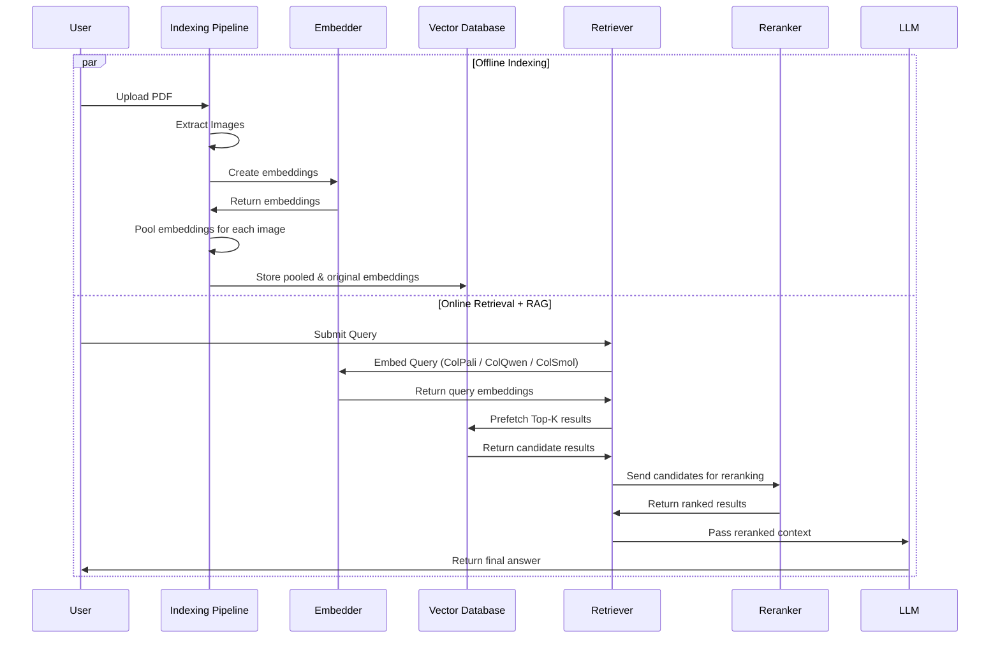
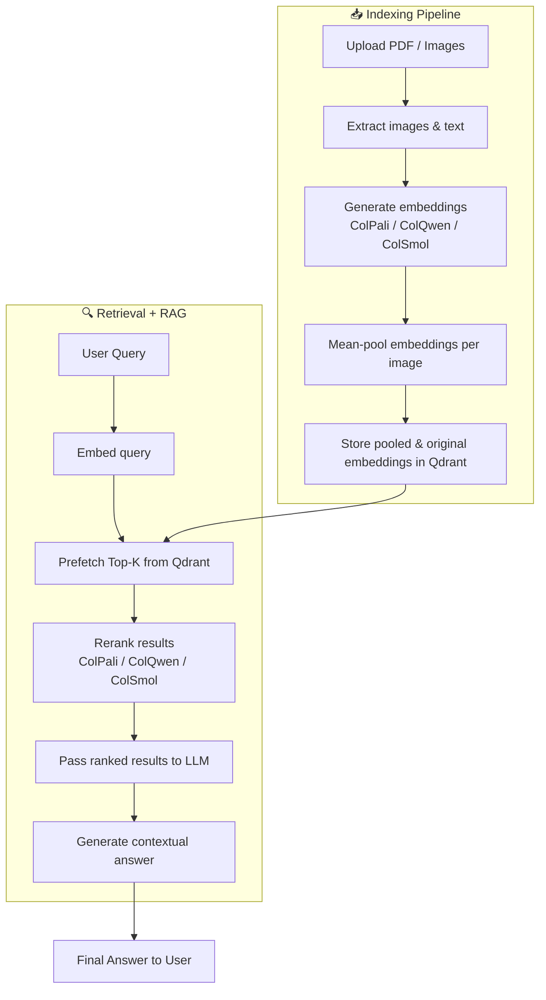

# 📄 PDF Search with Late Interaction

A fully local **Retrieval-Augmented Generation (RAG)** pipeline for **PDF search and question answering**.  
It uses **Late Interaction** with **ColPali / ColQwen / ColSmol** family of vision-language models for encoding PDF page images, stores embeddings in **Qdrant**, and answers queries using an **LLM** with retrieved context.

This project includes an **interactive Streamlit web app** to index PDFs and ask questions.

---

## 🚀 Features

-   **Multi-Vector embedding** of PDF pages.
-   **Vector search** powered by Qdrant with multi-vector support:
    -   Original embeddings
    -   Mean pooling over image rows
    -   Mean pooling over image columns
-   **Batch PDF indexing** (folder or individual files).
-   **Question answering** using retrieved context images.
-   **Local or remote LLMs** via [LiteLLM](https://github.com/BerriAI/litellm) API compatibility.
-   **Streamlit UI** for user-friendly PDF upload and querying.

---

## 🔍 Hybrid Search with Prefetch + Reranking

### Uses a two-stage retrieval pipeline for faster queries without losing accuracy:

1. **_Prefetch (Fast Retrieval)_** – Query pooled embeddings to quickly fetch top-K candidates from Qdrant.

2. **_Rerank (High Accuracy)_** – Pass candidates to ColPali, ColQwen, or ColSmol models for late-interaction reranking.

### Pros:

-   Faster response times.
-   Higher relevance with model-based reranking.

### Cons:

-   Requires extra storage for pooled embeddings.

## 📊 Visual Representation of the Pipeline

### Sequence Diagram



### Flowchart



---

## 🛠 Requirements

-   A supported GPU (CUDA or MPS) is recommended for faster performance.
-   Installed system dependencies for:
    -   **poppler** (required by `pdf2image`)

---

## 📦 Installation

1. **Clone the repository**

    ```bash
    git clone https://github.com/logxdx/contextualized-late-interation-with-pdfs.git
    cd contextualized-late-interation-with-pdfs
    ```

2. **Create and activate a virtual environment**

    ```bash
    python -m venv .venv
    source .venv/bin/activate   # On Windows: .venv\Scripts\activate
    ```

3. **Install dependencies**

    ```bash
    pip install -r requirements.txt
    ```

4. **Install Poppler**

    - **Linux (Debian/Ubuntu)**:

        ```bash
        sudo apt-get install poppler-utils
        ```

    - **macOS**:

        ```bash
        brew install poppler
        ```

    - **Windows**:

        - Download from: [https://github.com/oschwartz10612/poppler-windows/releases/](https://github.com/oschwartz10612/poppler-windows/releases/)
        - Add `bin` folder to your `PATH`.

5. **Configure environment variables**
   Create a `.env` file in the project root:

    ```env
    # API key & URL for your LLM provider (ollama by default)
    API_KEY=your_api_key_here
    BASE_URL=http://localhost:11434/v1

    # Optional Hugging Face token if model access is gated
    HF_TOKEN=your_hf_token_here
    ```

---

## 📂 Project Structure

```
contextualized-late-interation-with-pdfs/
│
├── rag.py              # Core RAG backend logic
├── app.py              # Streamlit UI
├── requirements.txt    # Python dependencies
├── .env.example        # Example environment file
└── README.md           # Project documentation
```

---

## ⚙️ Usage

### 1️⃣ Command-line Example

You can use the backend without the UI.

```bash
python rag.py
```

Inside `__main__`, update:

```python
rag = RAG("vidore/colpali-v1.3")
rag.index_file(pdf_path="attention_is_all_you_need.pdf", batch_size=1)
rag.answer(
    query="How does multi-headed attention work?",
    top_k=4,
    prefetch_limit=10
)
rag.close()
```

---

### 2️⃣ Running the Streamlit App

Start the web interface:

```bash
streamlit run app.py
```

**Main Tabs**:

-   **📥 Index PDFs**
    Upload PDF files or specify a folder to index.
-   **❓ Ask Questions**
    Enter your query and get an answer with retrieved page previews.

---

## 🧩 How It Works

1. **PDF Processing**

    - PDFs are converted to images (`pdf2image`).
    - Images are encoded into embeddings using **ColPali / ColQwen / ColSmol** models.

2. **Vector Storage**

    - Embeddings are stored in **Qdrant** with three vector fields:

        - `original`
        - `mean_pooling_rows`
        - `mean_pooling_columns`

3. **Retrieval**

    - For a query, text is embedded.
    - Qdrant searches across all three vector types.
    - Top matches (pages) are retrieved.

4. **Answer Generation**

    - Retrieved pages are sent as **image+text context** to an LLM.
    - The LLM answers based only on the given images.

---

## ⚡ Performance Notes

-   Use **GPU** for significant speedup.
-   Increase `batch_size` when indexing for faster throughput.
-   Reduce `dpi` in `_pdf_to_image` for lower memory use.

---

## 🛡️ Troubleshooting

-   **CUDA out of memory**: Reduce `batch_size` or use `torch.float16`.
-   **Poppler not found**: Install via your OS package manager.
-   **Model access denied**: Accept the model’s terms on Hugging Face and set `HF_TOKEN`.

---

## 📜 License

This project is released under the **MIT License**.

---

## 🙌 Acknowledgments

-   [ColPali Engine](https://github.com/illuin-tech/colpali)
-   [Qdrant](https://qdrant.tech/)
-   [LiteLLM](https://github.com/BerriAI/litellm)
-   [Streamlit](https://streamlit.io)
-   [pdf2image](https://github.com/Belval/pdf2image)
